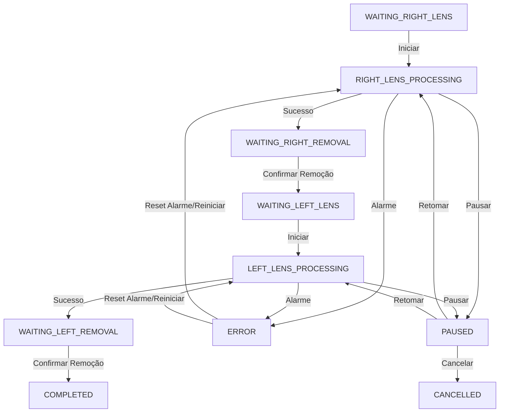

# LaserLab - Sistema Virtual-Industrial de Gravação Laser Freeform

O **LaserLab** é um sistema completo de simulação e controle operacional (estilo SCADA/MES) para gravação a laser de marcações técnicas e funcionais em lentes oftálmicas progressivas *freeform*.

O objetivo principal deste projeto é atuar como um **Laser Virtual Industrial**, permitindo o desenvolvimento, validação geométrica, teste de automação de fluxo de produção e homologação de arquivos G-code **sem a necessidade de uma máquina física inicial**.

---

## 🛠️ Arquitetura do Sistema

O sistema é dividido em duas camadas principais:

### 1. Backend (FastAPI / Python)
* **Monitor de Pastas (Watcher)**: Monitora a pasta `watch_dir/` utilizando a biblioteca `watchdog` para detectar automaticamente novos arquivos de medição OMA (`.oma` ou `.txt`).
* **Parser OMA**: Decodifica dados brutos de formato OMA (como tags `JOB`, `EYE`, `LNAM`, `TRCFMT`) em objetos estruturados.
* **Motor Geométrico (Geometry Engine)**: Realiza cálculos de posicionamento tridimensional aplicando calibração de offsets, escalas e rotações, com compensações geométricas devido à curvatura da lente (curva base).
* **Gerador de Vetores (Laser Integration)**: Converte os dados calculados em arquivos de visualização (SVG), arquivos de projeto nativos (LightBurn `.lbrn2`) e código de máquina industrial (G-code GRBL).
* **Simulador da Máquina Laser (CLP)**: Simula a física real de uma máquina laser em tempo real, incluindo variações de temperatura do diodo, potência em Watts, travas da porta de segurança física (intertravamento de segurança conforme NR-12) e telemetria operacional.
* **Transmissor G-code (GRBL Streamer)**: Transmite o código G-code linha a linha simulando o protocolo de comunicação serial GRBL (modo *wait-for-ok*), suportando fatiamento e retomada a partir de índices de interrupção (G-code Resumption).

### 2. Frontend (React / Vite)
* **Painel SCADA Industrial**: Interface em modo escuro de alta fidelidade visual, com transparências (glassmorphism) e sinalizações em neon.
* **Fila de Pedidos Integrada**: Agrupa arquivos individuais de lentes esquerda (OE) e direita (OD) em um único card de pedido, exibindo o status de cada lente em tempo real.
* **Visualizador CAD Interativo**: Rende os contornos da lente oftálmica e suas respectivas marcações. Durante a gravação, simula dinamicamente a oscilação do feixe do laser (varredura de galvonômetro) e a queima térmica superficial (fading hot trail).
* **Timeline de Rastreabilidade**: Exibe o histórico de logs operacionais gerados em tempo real pela máquina de estados.
* **Simulador de Alarmes**: Painel que permite injetar alarmes físicos na máquina (abertura de porta, sobreaquecimento, queda de energia) para testar os mecanismos de segurança de automação de emergência.

---

## 🕹️ Fluxo de Produção Guiado (Máquina de Estados)

O ciclo de vida de cada pedido contendo o par de lentes (OD e OE) é gerenciado por uma máquina de estados com 10 estágios:



* **Estágios WAITING**: Instruem o operador a posicionar ou remover a lente correspondente. O sistema impede a gravação física caso o sensor da porta esteja aberto ou ocorra inatividade prolongada (> 5 minutos).
* **Resumo de Gravação (Resumption)**: Caso o processo seja pausado, o operador pode retomar do mesmo comando G-code onde parou sem perder a lente física.

---

## ⚙️ Pré-requisitos

* **Python 3.10+** (com gerenciador de pacotes `pip`)
* **Node.js 18+** (com gerenciador de pacotes `npm`)

---

## 🚀 Como Executar o Projeto

Para rodar todo o ecossistema localmente (backend FastAPI e frontend React Vite), basta executar o script em lote na raiz do projeto:

```powershell
.\start.bat
```

Este script irá:
1. Iniciar o servidor backend FastAPI em `http://127.0.0.1:8001` (porta alternativa livre de conflitos).
2. Iniciar o servidor de desenvolvimento do React (Vite) no terminal ativo.
3. Abrir o navegador no endereço local do painel industrial.

*Nota: A base de dados SQLite é gerada automaticamente em `.data/oftolaserr.db`.*

---

## 🧪 Roteiros de Testes Automáticos

O backend inclui quatro suítes de testes diagnósticos fundamentais para validar o motor geométrico e o simulador físico. Para executá-los, acione o ambiente virtual do Python:

### 1. Teste de Fluxo de Produção e Estados (Integração)
Valida a injeção do par de lentes OMA, alertas de inatividade, pausa, retomada de gravação a partir de um índice de linha e cálculo de métricas operacionais.
```powershell
.\venv\Scripts\python.exe backend/verify_flow.py
```

### 2. Teste do Simulador Físico e Alarmes
Valida a física de temperatura, potência e a conformidade de segurança (corte imediato do laser ao simular a violação da porta).
```powershell
.\venv\Scripts\python.exe backend/verify_laser_simulator.py
```

### 3. Teste de Associação de Templates
Valida a identificação inteligente de lentes baseado nas tags OMA e aplicação das compensações de coordenadas.
```powershell
.\venv\Scripts\python.exe backend/verify_templates.py
```

### 4. Diagnóstico Geral do Motor Geométrico
Valida o parser OMA e pre-compensações tridimensionais de lentes progressivas.
```powershell
.\venv\Scripts\python.exe backend/verify.py
```
